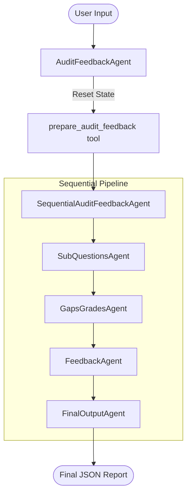

# Gap Analysis Agent

The **Gap Analysis Agent** is a multi-agent architectural evaluation pipeline. It decomposes complex architectural questions, evaluates user answers against specific criteria, identifies technical gaps (with citations), and synthesizes a professional feedback report.

## Architecture

The project employs a sequential multi-agent orchestration pattern to ensure a structured and validated flow of information.

### Agent Workflow



### Agent Responsibilities

| Agent                            | Responsibility                                                                                                                                                                   |
| :------------------------------- | :------------------------------------------------------------------------------------------------------------------------------------------------------------------------------- |
| **AuditFeedbackAgent**           | The Root Orchestrator. It resets the session state for every new request and delegates execution to the sequential pipeline.                                                     |
| **SequentialAuditFeedbackAgent** | Manages the ordered execution of all sub-agents, ensuring data flows correctly from one step to the next.                                                                        |
| **SubQuestionsAgent**            | Decomposes the primary architectural question into smaller, specific sub-questions for more granular analysis.                                                                   |
| **GapsGradesAgent**              | Evaluates the answer against each sub-question. It assigns scores (Good/Moderate/Poor) and identifies specific gaps, including citations to industry standards or documentation. |
| **FeedbackAgent**                | Synthesizes the raw evaluations and identified gaps into a cohesive, professional Markdown feedback report.                                                                      |
| **FinalOutputAgent**             | Formats the accumulated state into the final validated JSON schema required by the output keys.                                                                                  |

### Validation & Callbacks

The system uses a robust callback mechanism to manage state, performance, and validation:

- **`beforeAgentCallback`**: Executes before an agent starts processing. It is used to initialize or reset specific session state variables (e.g., clearing previous outputs) and mark the start time for performance tracking.
- **`beforeModelCallback`**: Implements a "Short-Circuit" pattern. If a valid result already exists in the state, it prevents unnecessary LLM calls.
- **`afterToolCallback`**: Manages a strict validation loop. If an agent's tool call (e.g., JSON validation) fails, it forces a retry until a valid schema is produced or a maximum attempt limit is reached.
- **`afterAgentCallback`**: Executes when an agent finishes its work. It is used to calculate and log performance metrics (e.g., execution time) and clean up resources.

---

## Prerequisites

### Local Environment

- **Node.js**: v18.0.0 or higher
- **npm**: v9.0.0 or higher
- **TypeScript**: The project is written in TypeScript and requires it for compilation.
- **Google Agent Development Kit (ADK)**: The framework used to orchestrate the multi-agent pipeline (`@google/adk`).

### Google Cloud & Vertex AI

This agent uses the Gemini model hosted on **Google Cloud Vertex AI**.

1. **GCP Project**: You must have an active GCP project with the **Vertex AI API** enabled.
2. **IAM Role**: The identity executing the agent (your user account or service account) **MUST** have the **Vertex AI User** (`roles/aiplatform.user`) role.
3. **Authentication**: Authenticate your local environment using the Google Cloud CLI:

   ```bash
   gcloud auth application-default login
   ```

---

## Local Setup & Execution

1. **Install Dependencies**:

   ```bash
   npm install
   ```

2. **Environment Configuration**:
   Create a `.env` file in the root directory (or copy `.env.example`):

   ```bash
   cp .env.example .env
   ```

   Set your model name and Vertex AI configuration details:

   ```env
   GEMINI_MODEL_NAME=gemini-3.1-flash-lite-preview
   GOOGLE_CLOUD_PROJECT=your-google-cloud-project-id
   GOOGLE_CLOUD_LOCATION=us-central1
   GOOGLE_GENAI_USE_VERTEXAI=true
   ```

3. **Run with ADK UI (Recommended)**:
   To interact with the agent via a web interface at `http://127.0.0.1:8000`:

   ```bash
   npm run web
   ```

4. **Run in CLI Mode**:
   To run the agent directly in your terminal:

   ```bash
   npm run cli
   ```

5. **Run API Server**:
   To serve the agent as an API at `http://127.0.0.1:8000`:

   ```bash
   npm run serve
   ```

---

## Testing

The project uses **Jest** for unit testing, particularly for validating the custom callback logic.

### Run All Tests

To execute all test suites:

```bash
npx jest
```

### Run Specific Tests

To run a specific test file (e.g., the callback retry logic):

```bash
npx jest src/sub-agents/callbacks/after-tool-retry-callback.test.ts
```

### Mocking & Context

Tests use `@jest/globals` to mock the ADK `context` and `state`. This allows for simulating different session scenarios, such as tool validation failures and max retry attempts, without needing a live LLM or GCP connection.
